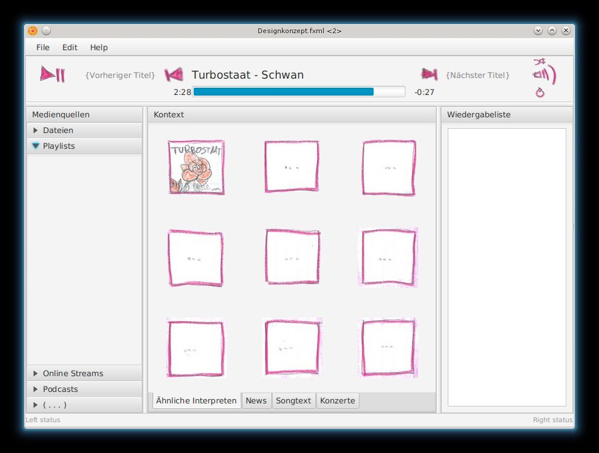
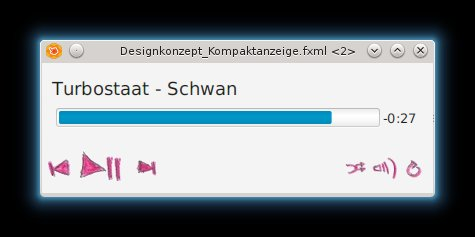

# Designkonzept-JavaFX-Mediaplayer
Ein Designkonzept für einen Mediaplayer mit Standardfunktionen, verschiedenen Medienquellen, kontextsensitiven informationen zu dem aktuell gespielten Künstlern und einer Playlist - umgesetzt in JavaFX

Privates Hobbykurzprojekt,
die Grafiken (c) 2016 Sonya Langerholc, MIT License, gemalt von ihr, eingescannt von mir.

# Screenshots
## Gesamtansicht

## Kompaktmodus

